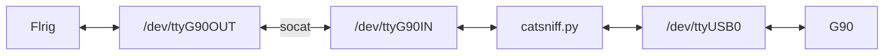

# g90puhuApp - Tools, examples and CAT for Xiegu G90 and Xiegu GSOC

## tools/catsniff.py

This tool was used to sniff CAT communication between Flrig and G90.
Created just to get familiar with CIV commands.


### Prerequisites

* Linux
* socat
* Python3
* Flrig
* G90 + CAT cable
* Permission to create /dev devices and read/write access to serial devices




### Setup

* Prepare virtual serial devices:

```
$ socat -dd pty,link=/dev/ttyG90OUT,raw,user=root,group=dialout,echo=0 pty,link=/dev/ttyG90IN
```

* Start the sniffer
```
$ python3 catsniff.py
```

* Start Flrig, setup and init.
```
Rig: Xiegu-G90
Serial: /dev/ttyG90OUT
Setup: 19200 1
```

### Output
```
Flr: FE FE 88 E0 03 FD 				<< HEADER + Get active VFO freq
G90: FE FE 88 E0 03 FD 				>> HEADER + Get active VFO freq
G90: FE FE E0 88 03 00 00 16 07 00 FD 		>> Reply from G90
Flr: FE FE 88 E0 07 01 FD 			<< HEADER + Select VFOSelect VFO-A
G90: FE FE 88 E0 07 01 FD 			>> HEADER + Select VFOSelect VFO-A
G90: FE FE E0 88 FB FD 				>> Reply from G90
Flr: FE FE 88 E0 03 FD 				<< HEADER + Get active VFO freq
G90: FE FE 88 E0 03 FD 				>> HEADER + Get active VFO freq
G90: FE FE E0 88 03 00 00 07 07 00 FD 		>> Reply from G90
Flr: FE FE 88 E0 04 FD 				<< HEADER + Get active VFO mode
G90: FE FE 88 E0 04 FD 				>> HEADER + Get active VFO mode
G90: FE FE E0 88 04 01 02 FD 			>> Reply from G90
```


## tools/g90sniff.py

This app is a main tool used to sniff communication between GSOC application
and G90 main unit. It is based on research found 
[here](https://github.com/zeroping/xiegu-g90-headprotocol/). 

Note: **xiegug90head.py** header is taken from this repository.

### Prerequisites

* GSOC device with [custom Linux](https://github.com/d3cker/gsoc-puhumod)
* socat
* Python3
* G90 main unit
* Remote access via SSH (for output)


### Setup

Due to closed source nature of GSOC application the setup requires some tricks
to make it work as expected. During the research it turns out that GSOC uses 
`/dev/ttyS1` for communication with G90 main unit using `head<>body` 
[protocol](https://github.com/zeroping/xiegu-g90-headprotocol/). As for now 
there is no known method to pass other port as a parameter for a command line.
GSOC application is also very picky as it won't accept a link as a device type.
It's recommended to start **g90sniffer.py** using SSH connection as the output
requires big console terminal. 

GSOC application has also possibility to accept CIV commands on `/dev/rfcomm0` 
port. The same picky nature was observerd here. In order to trick application 
to listen to command it's required to create non-link entity. In this 
repository, this method won't be researched as its main goal is to provide CAT
sever without GSOC application. 

* Rename /dev/ttyS1 to /dev/ttyG90
```
# mv /dev/ttyS1 /dev/ttyG90
```

* Create virtual serial ports
```
# socat -dd pty,link=/dev/ttyVGSOC,raw,user=root,group=dialout,echo=0 pty,link=/dev/ttyGSOC
```

* Mount `/dev/ttyVGSOC` as `/dev/ttyS1`
```
# mount -o bind /dev/ttyVGSOC /dev/ttyS1
```

* Start **g90sniffer.py** (over SSH)
```
# python g90sniffer.py
```

### Output

Click on the image below to view sniffer in action:

[](https://www.youtube.com/watch?v=8-x0HpGmOv8)


## app/g90app.py

This is just example application that may control G90 main unit. The only 
supported features are: 
* volume - `+/-`
* PTT - toggle with `Space`
* modulation - `]/[`

Prerequisites are the same as for **g90sniffer.py**

Usage:
```
# python g90app.py
```

## header/xiegug90head.py

This header file is required by **g90sniffer.py** and **g90app.py**. Just put
it in the same folder as python application. All creditis for this one go to 
developers from this [repo](https://github.com/zeroping/xiegu-g90-headprotocol/)

